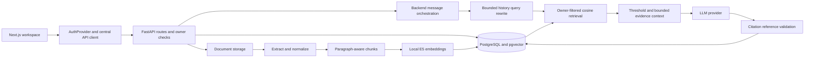

# Architecture

Source map including owner-accepted Phase 8E. Phase 8F adds a small native Modal component for upload/confirmations and the mobile drawer. Providers, message reconciliation and API contracts remain unchanged. Phase 8F implementation, owner-local automated validation, and owner manual regression are complete and accepted; see PHASE_8F_VALIDATION.md. Read actual routes/schemas before contract changes.

The frontend uses auth, document, conversation CRUD/detail and Phase 7 message routes.

## Backend and database

`app/main.py` registers routers and configured-origin CORS. Startup verifies database connectivity; `/health` is liveness, not continuous database readiness. `app/core/config.py` validates settings; `core/security.py` handles password/JWT primitives. `api/dependencies.py` supplies current identity and request-scoped sessions from `db/session.py`. Synchronous database endpoints execute through FastAPI's thread pool. Services own business operations and explicit transaction boundaries; Alembic runs separately from startup.

`app/api/` defines HTTP contracts, `app/schemas/` validation/public responses, `app/models/` relational models, and `app/services/` storage, processing, embeddings, search, RAG and chat behavior.

| Table | Relationship and purpose |
| --- | --- |
| users | UUID identity, unique email, password hash |
| documents | Owner FK, upload metadata, storage reference, processing and embedding state |
| document_chunks | Document FK, ordered chunk content; unique document/chunk index |
| chunk_embeddings | One vector per chunk, model metadata, vector(384) |
| conversations | User FK, title and timestamps |
| messages | Conversation FK, user/assistant role, sequence, content, grounding and retrieval query; unique conversation/sequence |
| message_citations | Message/document/chunk FKs, citation index and similarity score; unique message/citation index |

Migration sequence: `0001_create_users` → `0002_create_documents` → `0003_document_processing` → `0004_vector_embeddings` → `0005_conversations_and_messages` (current head). Document deletion cascades to chunks/embeddings and related citation rows. Conversation deletion cascades messages/citations but does not delete source documents. Citations reference live document/chunk rows, not immutable evidence snapshots; deletion or reprocessing can remove citation records while message text remains.

## Documents, embeddings and search

`document_storage.py` and `documents.py` separate secure file operations from metadata. Upload accepts PDF/DOCX/TXT, with a default 20 MiB limit. `document_processing.py` coordinates `text_extraction.py`, `text_normalization.py`, and `text_chunking.py`. Text PDF uses pypdf, DOCX uses python-docx, and scanned PDFs without text fail rather than receiving OCR.

Processing states are `uploaded`, `processing`, `processed`, `failed`. Paragraph-aware chunks use 1200-character size and 200-character overlap defaults. Successful reprocessing replaces chunks and invalidates embeddings; failures can preserve previous complete chunks, so status remains authoritative.

`document_indexing.py` indexes processed chunks through `embeddings.py`. Embedding states are `pending`, `indexing`, `indexed`, `failed`. E5 uses normalized 384-dimensional vectors, `passage: ` for chunks and `query: ` for questions. `semantic_search.py` computes cosine distance in PostgreSQL and returns score `1 - distance`, ordered deterministically with top-k limiting. Search requires the requesting owner, processed/indexed documents, and matching model; optional document IDs must all be owned. This is exact search, not an implemented ANN/hybrid/reranker pipeline. Never expose raw vectors in UI.

## RAG and multi-turn

`POST /rag/ask` uses `services/rag.py`: retrieve → similarity threshold → bounded context (`rag_context.py`) → provider (`llm.py`) → citation validation. `rag_prompt.py` treats document text as untrusted, requests answers only from context and in the user's language, and forbids invented legal references. No retrieved context skips answer generation and returns `grounded=false`, `citations=[]`. See PROJECT_CONTEXT.md for uncited-answer and fixed-language fallback limitations; reference validation is not proof of legal correctness.

`POST /conversations/{conversation_id}/messages` uses `services/chat.py`. It validates ownership and this message's document scope, persists the user message, loads up to 6 prior messages by default, then calls `query_rewrite.py`. With no history, retrieval uses the raw question. With history, an LLM rewrites intent to a standalone query (bounded to 1000 characters), followed by fresh retrieval. History also informs answer intent, explicitly labeled untrusted and not evidence. Only retrieved chunks supply evidence.

The backend never inherits document IDs from earlier messages. The request accepts `content` (1–4000 characters after trimming), `top_k` (default 5, range 1–10), and optional `document_ids` (1–100 if supplied; omit/null for the owner's eligible library, not an empty array). Inspect `schemas/conversation.py` before implementing callers. The response is one assistant `MessageRead`, not the complete conversation; detail returns persisted messages. User messages can remain saved after provider failure, so future UI retries must reconcile backend history rather than assume an atomic user/assistant pair.

## Frontend and authentication

`frontend/src/app/` uses App Router route groups `(auth)` and `(workspace)`. Routes include `/login`, `/register`, `/app/chat`, `/app/chat/[conversationId]`, `/app/documents`, `/app/documents/[documentId]`; root and `/app` redirect to chat. Layout/components hold the responsive shell, navigation and design styles. Default to Server Components, placing interaction in Client Components.

`components/auth/auth-provider.tsx` restores and validates identity with `/auth/me`; `auth-guards.tsx` protects workspace access. `lib/auth/token-storage.ts` centralizes v1 localStorage tokens. `lib/api/client.ts` attaches bearer tokens and handles authenticated 401s globally; failed public login remains a form error. Backend owner checks remain the security boundary. CORS uses FRONTEND_ORIGIN (default localhost:3000); the public frontend API base is NEXT_PUBLIC_API_BASE_URL (default example localhost:8000). No secrets belong in public frontend configuration.

Document components use `lib/documents/document-api.ts` for list/upload/detail/delete/process/index/chunks. Lists use `skip`/`limit`; mutation responses/refetches synchronize authoritative backend state. UI includes pagination, confirmations, chunks, and loading/error states without storage internals or vectors.

`components/conversations/conversation-provider.tsx` centralizes CRUD/list state through `lib/conversations/conversation-api.ts`. The sidebar derives active conversation from the URL, requests 20 items initially using `limit`/`offset`, and filters loaded titles locally. `/app/chat` renders an immediate composer; the existing createNew flow can queue a first message, navigate, then submit once the created conversation is the URL. `use-conversation-messages.ts` keeps keyed history and submission/recovery state across navigation without an active-ID store. It refetches after every POST attempt and compares new user-message IDs/content to the pre-send history before permitting draft restoration. Composer clears immediately; confirmed saved questions stay empty, uncertain network failures are never automatically restored/retried. An optional source dialog pages 20 documents at a time; each submission snapshots selected IDs then resets to all documents, omitting document_ids. CitationSource fetches on click, verifies live chunk ID, and displays the first non-empty paragraph capped at 280 characters (including ellipsis), without an internal scroll area plus a document-detail link. There are no chunk snapshots or local grounding inference. See [validation limitations](PHASE_8E_VALIDATION.md).

## API map

| Capability | Routes |
| --- | --- |
| Auth | POST /auth/register, POST /auth/login, GET /auth/me |
| Documents | GET/POST /documents; GET/DELETE /documents/{id}; POST /documents/{id}/process; POST /documents/{id}/index; GET /documents/{id}/chunks |
| Search/RAG | POST /search; POST /rag/ask |
| Conversations | GET/POST /conversations; GET/PATCH/DELETE /conversations/{id} |
| Backend messaging | POST /conversations/{id}/messages |

Foreign-resource access uses generic not-found responses where implemented, avoiding ownership disclosure. Inspect schemas for response structures and pagination differences; this map is not a substitute for source contracts.
